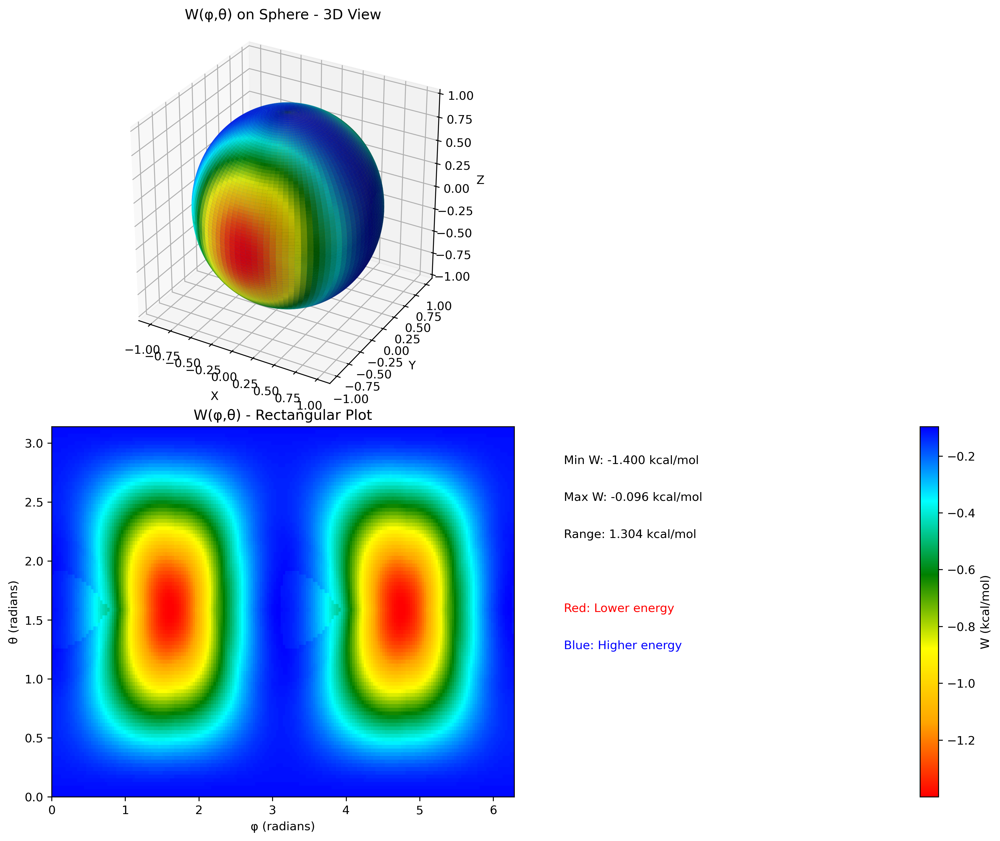

# Bell-BallMilling Model Calculator

[](LICENSE)

This program evaluates the work term W(φ,θ) applied to a molecular geometry under external pressure. This calculation is a key component of the Bell model used to understand how external forces can modify reaction energy barriers, particularly in the context of mechanochemistry and ball-milling simulations.

The script reads two molecular geometries (e.g., a reactant minimum and a transition state), aligns them, and then calculates the work done by an external, directional pressure across a sphere of orientations.

## Features

- **File-based Inputs**: Geometries and simulation parameters are loaded from simple text files, not hard-coded.
- **Mass-Weighted Alignment**: Removes overall translation and rotation using mass-weighted center of mass and a Kabsch alignment algorithm.
- **Van der Waals Correction**: Optionally includes atomic van der Waals radii to define the effective molecular surface.
- **Comprehensive Output**: Generates a summary text file, a full data matrix of the work function, and a 3D spherical plot for easy visualization.
- **Standard Python Packaging**: Easily installable as a Python package via `pip`, with a command-line entry point.

## Installation

This project is packaged following modern Python standards using `pyproject.toml`. The recommended way to install it is using `pip` in a virtual environment.

**Prerequisites:**
- Python 3.8 or newer
- `pip` and `venv`

### Installation Steps

1.  **Clone the repository:**
    ```bash
    git clone https://github.com/LMFrutos/Bell_BallMilling.git
    cd Bell_BallMilling
    ```

2.  **Create and activate a virtual environment:**
    ```bash
    # For Unix/macOS
    python3 -m venv venv
    source venv/bin/activate

    # For Windows
    python -m venv venv
    .\venv\Scripts\activate
    ```

3.  **Install the package:**
    Run the installation with `pip` from the project's root directory. This command will automatically read the `pyproject.toml` file, install all required dependencies (`numpy`, `scipy`, `matplotlib`), and set up the `bell-ballmilling` command-line script.

    ```bash
    pip install .
    ```

This makes the `bell-ballmilling` command available in your terminal.

## How to Run

After installation, you can run the calculation using the `bell-ballmilling` command. The program expects the input files to be present in the directory where you run the command.

1.  **Prepare your input files.**
    An example set is provided in the `example/input_files/` directory. For a quick test, copy them from the example folder to the project's root directory:

    ```bash
    # For Unix/macOS
    cp example/input_files/* .

    # For Windows
    copy example\input_files\* .
    ```

    The required files are:
    - `R_min.txt` (Initial geometry)
    - `R_TS.txt` (Transition state geometry)
    - `input.txt` (Calculation parameters)

2.  **Run the calculation:**
    Execute the command from your terminal:
    ```bash
    bell-ballmilling
    ```
    Alternatively, you can still run the script directly with Python:
    ```bash
    python Bell_BallMilling.py
    ```

3.  **Check the results.**
    The script will generate three output files in the current directory:
    - `output.txt`: A summary of the input parameters and key results.
    - `W.mtx`: The complete work function data.
    - `W_spherical.png`: A visual representation of the work function.

    You can compare your generated files with the reference outputs located in `example/output_files/`.

## File Formats

### Input Files

**`R_min.txt` / `R_TS.txt`**
-   **Line 1**: `N` (an integer representing the number of atoms).
-   **Lines 2 to N+1**: `Z x y z` (atomic number and Cartesian coordinates in Ångstroms), with each atom on a new line.
```text
3
8 0.000000 0.117300 -0.054400
1 -0.757200 -0.469200 -0.054400
1 0.757200 -0.469200 -0.054400
```

**`input.txt`**
-   **Line 1**: External pressure `P_ext` in GPa (float).
-   **Line 2**: Grid resolution for the `θ` coordinate, `ntheta` (integer). The `φ` grid will be `2 * ntheta`.
-   **Line 3**: A string `YES` or `NO` to indicate whether to include van der Waals radii.
```text
1.0
100
YES
```

### Output Files

- **`output.txt`**: A human-readable summary of the calculation.
- **`W.mtx`**: A machine-readable matrix file (`phi  theta  W(phi,theta)`).
- **`W_spherical.png`**: A PNG image showing the work function plotted on a sphere.

## Output Visualization

The script generates a composite image that helps visualize the directional dependence of the work term. Red areas indicate orientations where the external force stabilizes the transition state (lower work), while blue areas indicate destabilization (higher work).



## License

This project is licensed under the MIT License. See the [LICENSE](LICENSE) file for details.
      
